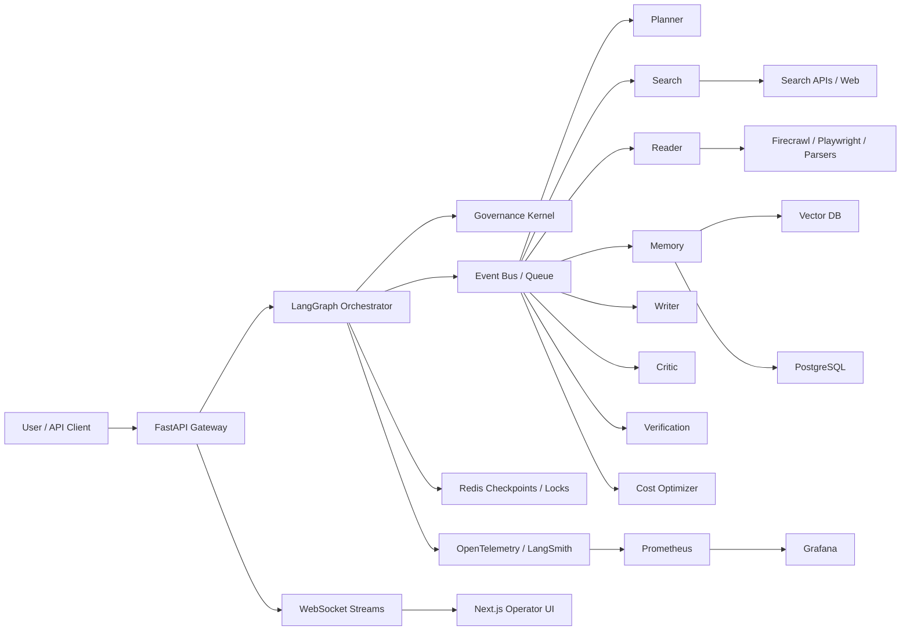
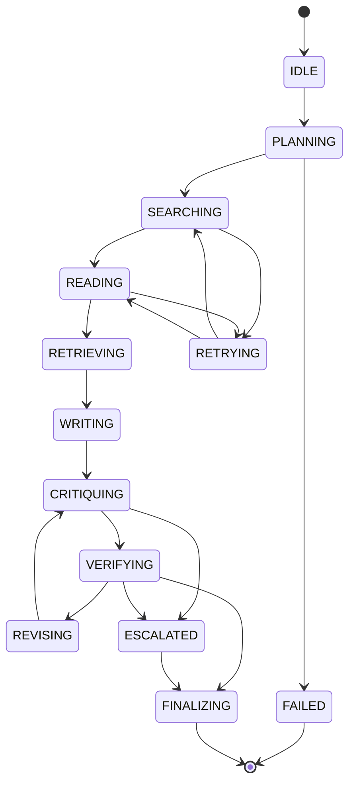
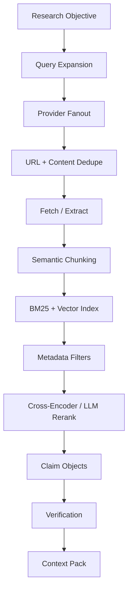
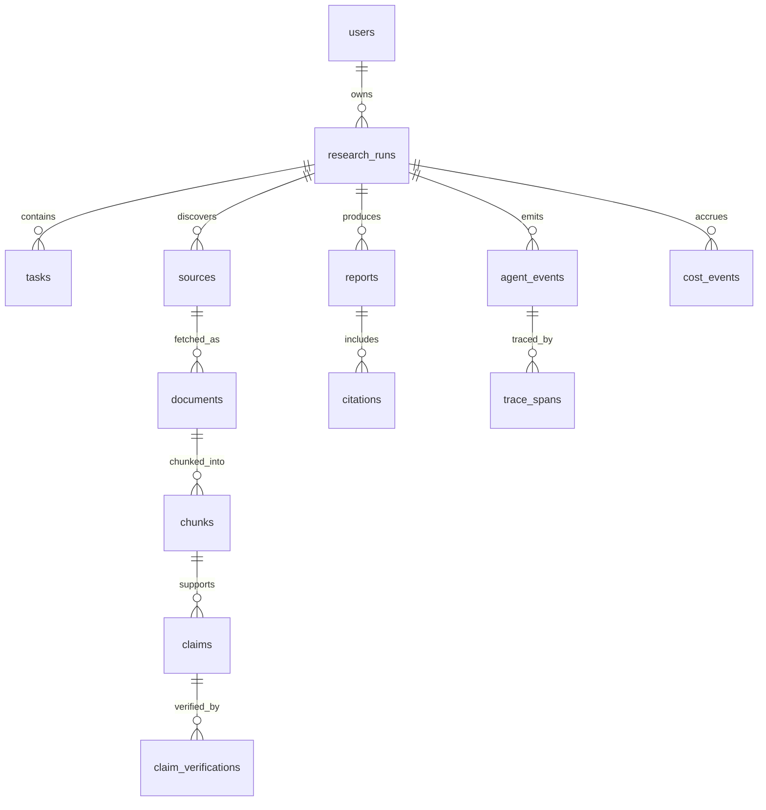

# Omega Research Grid
## Production Architecture Blueprint

Omega Research Grid is a deterministic, observable, governed multi-agent research operating system. Its design goal is not "chat with tools"; it is a coordinated digital research organization that plans, searches, reads, remembers, verifies, writes, critiques, revises, and audits every claim.

## 1. System Goals

### Primary Capabilities

- Convert ambiguous research objectives into bounded execution DAGs.
- Retrieve live, authoritative, diverse sources.
- Extract claims, entities, statistics, citations, contradictions, and provenance.
- Synthesize evidence-grounded professional reports.
- Independently verify citations and claims.
- Track cost, confidence, latency, token usage, and failure modes.
- Resume, replay, audit, and evaluate executions.

### Non-Negotiable Properties

- Deterministic orchestration: every run is a versioned state graph with explicit transitions.
- Governed autonomy: agents operate inside policy, budget, tool, recursion, and safety boundaries.
- Structured communication: all agent messages are typed, traceable, serializable, and replayable.
- Evidence grounding: final prose is linked to extracted claims and source references.
- Evaluation-driven operation: quality gates block weak reports before delivery.

## 2. High-Level Architecture



Why this exists: a research platform needs separation between user I/O, orchestration, policies, agents, evidence stores, and observability. A single agent loop cannot provide deterministic replay, bounded failure handling, or enterprise auditability.

Tradeoffs: this architecture is heavier than a simple LangChain app. It pays operational complexity to gain isolation, traceability, resumability, and evaluation gates. The scalability ceiling is much higher because search, reading, verification, and evaluation can run concurrently behind queues.

Production risks: graph deadlocks, queue storms, runaway token usage, source poisoning, stale memory retrieval, model drift, rate limits, and partial failures. Mitigations are covered by governance, circuit breakers, checkpointing, confidence scoring, and eval thresholds.

## 3. Orchestration Choice

### Compared Options

| Framework | Strengths | Weaknesses | Production Fit |
|---|---|---|---|
| LangGraph | Explicit state graphs, checkpointing, human interrupts, deterministic routing | Requires careful state schema discipline | Best primary orchestrator |
| LCEL | Excellent chain composition and model/tool pipes | Not sufficient alone for long-running multi-agent FSMs | Use inside nodes |
| CrewAI | Simple role-based collaboration | Less deterministic and weaker enterprise observability | Useful for prototypes only |
| AutoGen | Conversational multi-agent patterns | Harder to bound, replay, and govern deterministically | Selective research experiments |
| Semantic Kernel | Enterprise plugin patterns, planning | Less native to LangChain/LangGraph ecosystem | Good for .NET-centric shops |
| Custom Engine | Full control | Expensive, risky, longer time to correctness | Use only for kernel extensions |

Decision: LangGraph is the orchestration backbone. LCEL composes model, retrieval, extraction, and scoring chains within each graph node. Redis/PostgreSQL checkpoint state; Celery/RQ/Arq or a Kafka-compatible bus distributes heavy work.

Why: LangGraph gives explicit state machines and checkpointable transitions without hiding control flow. Determinism and replay matter more than agent role theatrics.

## 4. Execution State Machine



State rules:

- `PLANNING`: create DAG, budgets, source strategy, evaluation gates.
- `SEARCHING`: query expansion, provider fanout, ranking, dedupe.
- `READING`: extraction, sanitization, chunking, claim mining.
- `RETRIEVING`: memory plus fresh evidence assembly.
- `WRITING`: grounded draft generation.
- `CRITIQUING`: adversarial factual, logical, citation, and clarity review.
- `VERIFYING`: independent source and claim checks.
- `REVISING`: bounded improvement loop.
- `ESCALATED`: human review or premium-model arbitration.

Rollback logic: failed node outputs are not deleted; they are marked invalid and superseded. Checkpoints retain state, input hash, model version, tool version, budget snapshot, and trace ID. Retrying reuses validated upstream artifacts and invalidates dependent downstream artifacts.

Timeout handling: every node has a soft timeout, hard timeout, and cancellation token. Soft timeout triggers degradation; hard timeout emits failure event and returns to governance for retry, fallback, or escalation.

## 5. Agent Governance Kernel

The governance layer behaves like an OS kernel for agentic execution.

Responsibilities:

- Enforce execution budgets: tokens, dollars, wall time, recursion depth, API calls.
- Enforce tool permissions by agent, run type, tenant, and trust level.
- Detect loops using repeated state hashes, stagnant confidence, repeated query signatures, and unchanged outputs.
- Validate schemas and block unstructured outputs from entering shared state.
- Route models dynamically based on task risk, complexity, privacy, and cost.
- Apply circuit breakers for external providers.
- Audit every decision and memory access.

Why it exists: autonomous agents otherwise optimize for completing local prompts, not global safety, cost, or correctness.

Failure modes:

- Overly strict policies block useful research.
- Overly loose policies permit runaway calls or poisoned evidence.
- Centralized governance can become a bottleneck.

Optimizations:

- Cache policy decisions.
- Use static preflight checks for DAGs before execution.
- Use streaming budget counters so runaway nodes are killed early.
- Split hot-path policy checks from slower audit persistence.

## 6. Inter-Agent Communication Protocol

Serialization: JSON for operational events; MessagePack optional for high-volume internal queues. All messages are Pydantic-validated and versioned.

Core envelope:

```json
{
  "message_id": "uuid",
  "trace_id": "uuid",
  "run_id": "uuid",
  "parent_message_id": "uuid|null",
  "event_type": "TASK_ASSIGNED|TASK_RESULT|CLAIM_EXTRACTED|EVIDENCE_VERIFIED|POLICY_VIOLATION",
  "sender": "planner",
  "recipient": "search",
  "task_id": "uuid",
  "state": "SEARCHING",
  "confidence": 0.82,
  "cost": {"input_tokens": 1200, "output_tokens": 400, "usd": 0.012},
  "memory_refs": ["mem://session/claim/123"],
  "dependencies": ["task-a", "task-b"],
  "payload": {},
  "created_at": "2026-05-13T00:00:00Z"
}
```

Event bus design:

- Redis Streams for local deployment and fast checkpoint coupling.
- Kafka or Redpanda for high-volume multi-tenant deployment.
- Dead-letter queues per agent and per provider.
- Pub/sub channels for UI streaming: run state, graph updates, source ingestion, confidence heatmaps, trace spans.

## 7. Agent System

### Planner Agent

Outputs execution DAG, dependency tree, task allocation, budgets, and timelines. It recursively decomposes the objective until each task has clear inputs, expected outputs, confidence criteria, and cost limits.

Risks: over-decomposition, hallucinated research paths, poor cost estimation. Mitigation: governance validates DAG size, max branching, required verification tasks, and budget feasibility.

### Search Agent

Performs query expansion, provider fanout, dedupe, source ranking, freshness scoring, and authority scoring across Tavily, SerpAPI/Bing, arXiv, PubMed, Semantic Scholar, and site-specific retrieval.

Ranking model:

```
score = bm25 * 0.20
      + vector_similarity * 0.20
      + authority * 0.25
      + freshness * 0.15
      + citation_network_quality * 0.10
      + source_diversity_bonus * 0.10
      - duplication_penalty
```

Failure modes: search API outages, SEO spam, duplicate syndication, recency bias. Mitigation: provider quorum, domain allow/deny policies, source diversity constraints, and cached search snapshots.

### Reader Agent

Extracts from HTML, PDFs, academic APIs, and dynamic pages. It sanitizes content before model exposure, removes prompt injection text, strips scripts, normalizes boilerplate, chunks semantically, extracts claims, statistics, entities, citations, and contradictions.

Security: webpage text is untrusted data. It is never allowed to issue tool instructions. The system wraps it as evidence-only content and logs injection patterns.

### Memory Agent

Memory layers:

- Working memory: current DAG state, pending tasks, recent artifacts.
- Session memory: sources, claims, summaries, citations, decisions.
- Long-term semantic memory: reusable research knowledge and prior validated reports.
- Episodic memory: run traces, corrections, failures, quality outcomes.

Retrieval strategy: hybrid BM25 plus dense vectors, metadata filters, recency decay, trust filters, and reranking. Context assembly prioritizes verified claims over raw chunks and includes provenance.

Pruning: low-confidence, duplicate, stale, or unsupported memories are compressed or tombstoned, not silently deleted.

### Writer Agent

Generates report sections with evidence references and uncertainty annotations. It cannot invent citations; each cited sentence must map to source IDs or verified claim IDs.

Report structure: Executive Summary, Abstract, Introduction, Research Methodology, Core Analysis, Technical Breakdown, Key Findings, Counterarguments, Risks, Future Outlook, Conclusion, References.

### Critic Agent

Scores factuality, coherence, depth, rigor, source quality, reasoning quality, and citation accuracy. It runs adversarial review and produces actionable revision instructions, not vague criticism.

Quality gate: a report below threshold is revised or escalated.

### Verification Agent

Independently validates URLs, publication dates, authorship, claim support, citation-target alignment, and cross-source agreement. It flags weak evidence, unsupported claims, contradictions, and outdated references.

### Cost Optimization Agent

Tracks token/dollar budgets and routes tasks:

- Cheap models for classification, dedupe, formatting, extraction prepasses.
- Premium models for planning, synthesis, adversarial critique, and ambiguous conflict resolution.
- Local models for embeddings, boilerplate filtering, clustering, and batch scoring when acceptable.

Optimization: adaptive summarization, prompt caching, semantic result caching, batch embeddings, early stopping, and context compression.

## 8. Retrieval Pipeline



Chunking:

- HTML: section-aware chunks, 500-900 tokens, overlap only at heading boundaries.
- PDFs: layout-aware chunks with page anchors.
- Academic papers: abstract, methods, results, limitations, references separated.
- Tables/statistics: structured extraction before natural language summarization.

Reranker selection:

- Cross-encoder reranker for scale and consistency.
- LLM reranker only for high ambiguity or expert synthesis.

Thresholds:

- Retrieval threshold starts at 0.72 semantic relevance.
- Lower only when source diversity is insufficient.
- Verified claim threshold must exceed 0.80 for direct factual statements.

## 9. Database Design



PostgreSQL tables:

- `research_runs`: user objective, state, budgets, model policy, timestamps.
- `tasks`: DAG nodes, dependencies, owner agent, status, retries.
- `agent_events`: immutable event log.
- `sources`: URL, domain, authority score, freshness, trust rating.
- `documents`: normalized extracted content metadata.
- `chunks`: text hash, offsets, page anchors, embedding IDs.
- `claims`: atomic claim text, source refs, confidence.
- `claim_verifications`: verifier, result, evidence, contradictions.
- `reports`: markdown, PDF path, quality scores.
- `citations`: sentence span to source/claim mapping.
- `cost_events`: provider, model, token counts, USD estimate.
- `audit_logs`: policy decisions, tool calls, permission checks.

Indexes:

- B-tree: `run_id`, `task_id`, `state`, `created_at`.
- GIN: JSONB payload fields and full text search.
- pgvector or external vector DB for embeddings.
- Unique hashes for source URL canonicalization and chunk dedupe.

Scaling: partition event, trace, and cost tables by time and tenant. Keep hot run state in Redis; persist immutable audit history in PostgreSQL/object storage.

## 10. API Design

REST:

- `POST /v1/runs`: create research run.
- `GET /v1/runs/{run_id}`: run status.
- `POST /v1/runs/{run_id}/cancel`: cancellation.
- `GET /v1/runs/{run_id}/report`: final report.
- `GET /v1/runs/{run_id}/sources`: paginated sources.
- `GET /v1/runs/{run_id}/events`: paginated event log.
- `GET /v1/runs/{run_id}/trace`: trace tree.
- `POST /v1/evals/run`: execute evaluation suite.

WebSocket:

- `/ws/runs/{run_id}` streams state transitions, graph changes, agent events, trace spans, costs, source ingestion, draft sections, confidence heatmap updates, and quality-gate results.

Security:

- OAuth/OIDC or enterprise SSO.
- Tenant-scoped runs.
- Signed artifact URLs.
- Per-user and per-tenant rate limits.
- Tool permissions enforced server-side, never by frontend hints.

## 11. Observability

Every node emits:

- OpenTelemetry span with `run_id`, `task_id`, `agent`, `state`, `model`, `provider`, latency, retries, confidence.
- LangSmith trace for model calls, prompts, outputs, parsers, and tool calls.
- Prometheus metrics for throughput, latency, errors, token usage, cost, queue depth, verification failure rate, citation accuracy, retrieval precision proxy, and report quality scores.
- Immutable audit event for policy decisions and memory reads/writes.

Dashboards:

- Run timeline and state graph.
- Agent throughput and failure rate.
- Provider latency and error budgets.
- Token and cost burn-down.
- Retrieval quality and source trust distribution.
- Citation verification pass/fail.
- Eval regression trend.

Replay: a run can be replayed from checkpoints with the same source snapshot and model version metadata. Non-deterministic model outputs are captured as artifacts for audit comparison.

## 12. Security Hardening

Attack surfaces:

- Prompt injection in webpages and PDFs.
- SSRF through URL fetchers.
- Credential leakage in traces.
- Malicious documents.
- Tool overreach.
- Cross-tenant memory leakage.
- Model output causing unsafe tool calls.

Mitigations:

- Treat all retrieved content as untrusted evidence.
- Strip scripts, forms, hidden text, and suspicious instruction blocks.
- Fetch through an egress proxy with DNS/IP allow and deny rules.
- Block private IP ranges, metadata endpoints, and localhost fetches.
- Store secrets only in a vault or environment secret manager.
- Redact traces before persistence.
- Enforce tenant IDs in every DB and vector query.
- Use allowlisted tools per agent.
- Require governance approval before network, filesystem, or expensive model calls.

## 13. Reliability Engineering

Retries:

- Exponential backoff with jitter.
- Idempotency keys per task.
- Retry only safe and deterministic operations automatically.
- Dead-letter non-recoverable payloads with full trace context.

Circuit breakers:

- Per provider, per tenant, per endpoint.
- Open on latency/error thresholds.
- Half-open with small probe traffic.

Graceful degradation:

- Search provider failure: use cached results and alternate APIs.
- Premium model outage: route to secondary provider with stricter critique.
- Vector DB outage: fall back to PostgreSQL full text plus cached summaries.
- Reader failure: use search snippets only with lower confidence labels.

## 14. Evaluation Framework

Metrics:

- Factuality score.
- Hallucination rate.
- Citation accuracy.
- Retrieval precision and recall.
- Source authority distribution.
- Contradiction detection rate.
- Report coherence and depth.
- Latency and cost per successful report.
- Token efficiency.

Automated gates:

- Citation accuracy >= 0.95 for production publishing.
- Unsupported claim rate <= 0.03.
- Verification coverage >= 0.90 for key claims.
- Report factuality >= 0.88.
- Retrieval diversity: at least three independent high-quality sources for contested claims.

Datasets:

- Golden research prompts with hand-labeled source sets.
- Claim verification benchmark.
- Citation alignment benchmark.
- Regression set for prompt injection pages.
- Latency and load test scenarios.

Human rubric:

- Research completeness.
- Evidence quality.
- Reasoning rigor.
- Uncertainty handling.
- Clarity and executive usefulness.

## 15. Frontend Architecture

Next.js operator UI:

- Run launcher with objective, budget, depth, source policy, and model policy.
- Live execution graph viewer.
- Agent activity timeline.
- Source explorer with credibility, freshness, and extracted claims.
- Memory inspector with session and semantic recall views.
- Citation viewer mapping report sentences to source claims.
- Report editor with confidence annotations.
- Trace viewer for spans, prompts, tool calls, and errors.
- Confidence heatmaps across report sections.
- Cost and latency panels.

UX principle: this is an operations console, not a marketing page. It prioritizes dense, readable, inspectable workflows.

## 16. Deployment Architecture

Local production-like stack:

- FastAPI backend.
- Next.js frontend.
- PostgreSQL.
- Redis.
- ChromaDB or Weaviate.
- Prometheus.
- Grafana.
- OpenTelemetry collector.
- Nginx reverse proxy.

Kubernetes:

- API deployment with HPA on CPU and request latency.
- Worker deployments per agent class.
- Queue backend.
- Stateful PostgreSQL managed service.
- Managed Redis.
- Managed vector DB or dedicated stateful set.
- Secrets via cloud secret manager.
- Network policies isolating workers.
- Egress proxy for web retrieval.

Autoscaling:

- Search and reader workers scale on queue depth.
- Writer and critic workers scale on model-call latency and backlog.
- Verification workers scale on claim count.

## 17. CI/CD

Pipeline stages:

- Static checks: ruff, mypy, eslint, typecheck.
- Unit tests.
- Integration tests with mocked providers.
- Prompt injection regression suite.
- Evaluation smoke tests.
- Docker build.
- Trivy/Semgrep security scan.
- Infrastructure validation.
- Deploy to staging.
- Run canary research tasks.
- Promote with quality gates.

## 18. Performance Strategy

Bottlenecks:

- Web fetch latency.
- PDF extraction.
- Embedding batch throughput.
- Reranking cost.
- Premium model synthesis.
- Vector DB query tail latency.

Optimizations:

- Parallel provider fanout.
- Source fetch batching with per-domain concurrency limits.
- Batch embeddings and cache by content hash.
- Summarize once, reuse many times.
- Keep verified claims as compact context units.
- Use streaming report generation.
- Apply early stopping when evidence sufficiency is reached.

Tradeoff: aggressive caching reduces cost but risks stale research. Cache entries must carry freshness policy and source timestamps.

## 19. Folder Structure

```text
backend/
  app/
    api/
    agents/
    core/
    governance/
    memory/
    orchestration/
    retrieval/
    schemas/
    security/
    telemetry/
    evaluation/
frontend/
  app/
  components/
infra/
  docker-compose.yml
  docker/
  k8s/
tests/
docs/
```

## 20. Implementation Roadmap

Phase 1: Contracts and deterministic run lifecycle.

- Implement message schemas, state machine, governance preflight, run persistence, WebSocket streaming, and trace emission.

Phase 2: Retrieval and reader pipeline.

- Add search provider adapters, Firecrawl/Playwright readers, sanitization, chunking, embeddings, BM25, vector search, and reranking.

Phase 3: Agent graph.

- Build LangGraph nodes for planner, search, reader, memory, writer, critic, verifier, cost optimizer, and finalizer.

Phase 4: Evidence-grounded reporting.

- Implement claim store, citation mapping, report generation, critique/revision loop, and verification gates.

Phase 5: Observability and evaluation.

- Add dashboards, replay, benchmark datasets, regression gates, and quality thresholds.

Phase 6: Enterprise hardening.

- Add tenancy, auth, RBAC, egress proxy, rate limits, secret isolation, audit export, load testing, and Kubernetes deployment.

Phase 7: Optimization.

- Add model routing, prompt caching, context compression, local model adapters, queue autoscaling, and cost-aware scheduling.
